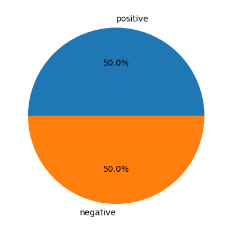
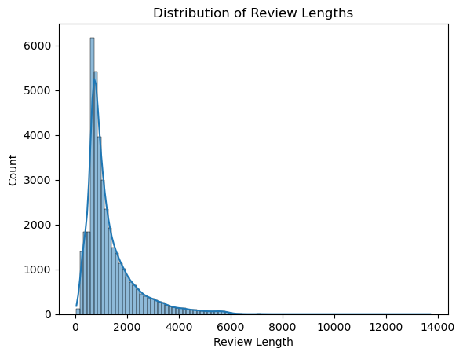
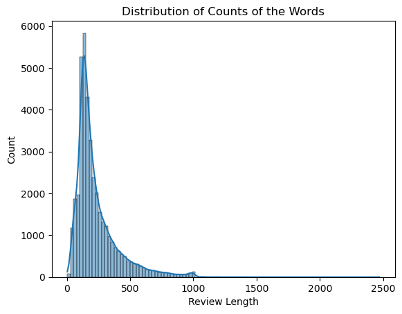
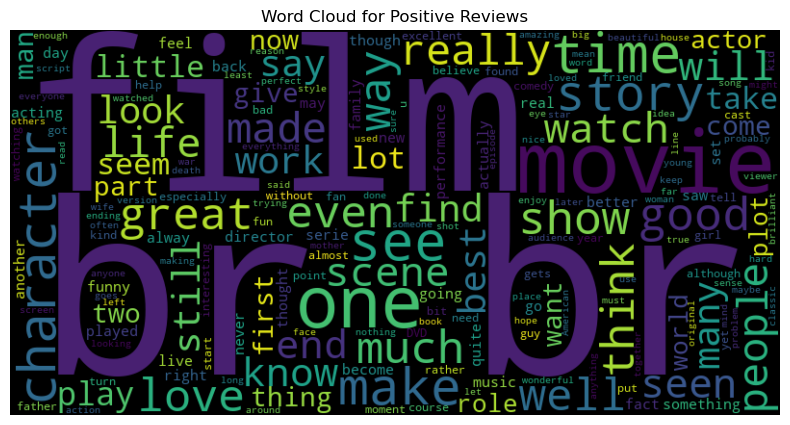
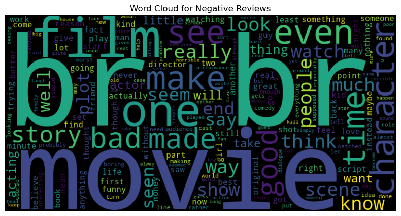

# **Binary Sentiment Classification for Movie Reviews**

Welcome to `data-science-task` Machine Learning project. This project is all about understanding and predicting sentiments in movie reviews. We've got a dataset with 40,000 reviews, each labeled with sentiments. The goal is to build a model that can analyze these sentiments effectively. So, let's dive into the world of movie opinions and explore the patterns with machine learning techniques!


## **Project Structure:**
```
data-science-task
├── data                            
│   ├── processed                   # It will be generated after running train.py script
│   │    ├── train.csv
│   │    └── test.csv
│   └─── raw                        # It will be generated after running data_loader.py script
│        ├── train.csv
│        └── test.csv
├── notebooks   
│   ├── images                      # Stores the plots of the analysis                 
│   └── movies.ipynb                # Contains the DS part of the project
├── outputs                         
│   ├── models                      # Contains model and vectorizer file
│   │   └── various model files 
│   └── predictions                  
│       ├── inference               # Contains predictions and evaluation metrics after inference
│       └── validation              # Contains predictions and evaluation metrics after validation
├── src                             
│   ├── inference                   # Scripts and Dockerfiles used for inference
│   │   ├── __init__.py
│   │   ├── Dockerfile
│   │   └── run_inference.py                     
│   ├── train                       # Scripts and Dockerfiles used for training
│   │   ├── __init__.py             
│   │   ├── Dockerfile  
│   │   └── train.py                # To prepare the data, train the model and evaluate on the validation set
│   ├── data_loader.py              # To download the data and store it in data/raw
│   ├── data_preparation.py         # Contains basic text preparation techniques
│   └── evaluation.py               # Contains basic functions to evaluate the model
├── .gitignore
├── README.md
├── requirements.txt                
├── settings.json                   # All configurable parameters and settings
└── utils.py                        # Utility functions and classes that are used in scripts
```
## **Data:**
As I mentioned before the dataset contains 40,000 movie reviews annotated with sentiment labels. I also have an inference dataset with 10,000 records for testing the model's performance.

# **DS part report**
## **Checking Notebook**
First, to check the notebook, you need to run the `src/data_loader.py` script to download the data.

## **Exploratory Data Analysis**
### **Distribution of Labels**
We know that the data set contains 40,000 records.
The data is balanced, it has 20,000-20,000 positive and negative reviews.


### **Distribution of Lengths**
1. Letters:
It is a good practice to check the length of a review. The average is 800-900 letter/review.

    

2. Words:
The average is around 200 words/review.

    

### **Wordclouds**
The more frequently a word appears in the text, the larger and more prominent it appears in the word cloud.
- Wordcloud for positive reviews:

    

- Wordcloud for negative reviews:

    

## **Feature Engineering**
1. On the reviews feature I had to apply a preprocessing pipeline. 
The provided `preprocess_text` function conducts several essential text preprocessing steps to prepare the data for further analysis and modeling. Here are the key conclusions regarding the data preprocessing steps:

    1. The text contains HTML tags, like `<br>`, so I needed to apply a removal function `clean_html_tags`.
    2. Next, I removed the punctuations and the numbers.
    3. Later, I lower the letters before tokenizing.
    4. Tokenization, break the text into individual words.
    5. Removing common english stop words.
    6. The lemmatization process is applied using the WordNet lemmatizer, reducing words to their base or root form.
    7. Removing short tokens, that length is smaller than 3.
    8. After these steps, the tokens are joined back into a text.

2. I encoded the sentiment feature, which originally had only positive or negative values, by assigning the numerical value 1 to label "positive" to and the numerical value 0 to the label "negative" to .

### **Stemming vs Lemmatization**
Lemmatization as a data preprocessing step resulted in faster processing, and the trained model had higher accuracy compared to when the stemming step was used.

### **Vectorization**
I had to implement vectorization before employing any modeling algorithms. After using the same classification algorithm with two different vectorizer, it was observed that the TfidfVectorizer outperformed the HashVectorizer in terms of model accuracy and was faster to fit it.

## **Modeling**
I chose to apply three algorithms to this classification task: Logistic Regression, SVM, and Multinomial Naive Bayes. When considering model accuracy, the ranking from lowest to highest is as follows: Multinomial Naive Bayes has the lowest accuracy, followed by SVM, and Logistic Regression has the highest accuracy. SVM could be a good choice to use but it is much more time to fit and make predictions, than the Logistic Regression, so i chose LR to use.


### **Evaluation on the validation set**
- Logistic Regression

            Classification Report:
                        precision    recall  f1-score   support

                    0       0.91      0.88      0.89      3991
                    1       0.89      0.91      0.90      4009

             accuracy                           0.89      8000
            macro avg       0.90      0.89      0.89      8000
         weighted avg       0.90      0.89      0.89      8000

- SVM

            Classification Report:
                        precision    recall  f1-score   support

                    0       0.90      0.89      0.89      3991
                    1       0.89      0.90      0.89      4009

             accuracy                           0.89      8000
            macro avg       0.89      0.89      0.89      8000
         weighted avg       0.89      0.89      0.89      8000


- Multinominal Naive Bayes

            Classification Report:
                        precision    recall  f1-score   support

                    0       0.85      0.88      0.87      3991
                    1       0.88      0.84      0.86      4009

             accuracy                           0.86      8000
            macro avg       0.86      0.86      0.86      8000
         weighted avg       0.86      0.86      0.86      8000


- Logistic Regression has the best report, has the best precision, recall, f1-score and accuracy, so I will tune its hyperparameters.


### **Hyperparameter Tuning**
The `Logistic Regression` best hyperparameters are:
'C': 4.9, 'penalty': 'l2', 'solver': 'liblinear'
    
            Classification Report:
                        precision    recall  f1-score   support

                    0       0.91      0.89      0.90      5000
                    1       0.89      0.91      0.90      5000

             accuracy                           0.90     10000
            macro avg       0.90      0.90      0.90     10000
         weighted avg       0.90      0.90      0.90     10000

## **Potential business applications and value for business**
- Monitoring sentiment in movie reviews allows studios and producers to understand how audiences are responding to their films.
- It can help marketing teams to understand what aspects of the movie resonate with the audience. This information can be used to create effective marketing campaigns.
- Positive sentiments can be highlighted in promotional materials, and areas of improvement from negative sentiments can be addressed in marketing strategies.
- Early detection of negative sentiments can be crucial for managing potential controversies or issues related to a movie.
- Businesses can use it to monitor and compare the success of their movies against competitors.
- Investors in the entertainment industry can use it as part of their due diligence when considering investment opportunities.

# **MLE part**

## **Quickstart**
First of all, if you have not done it, you need to clone the project with the following command in the terminal:
```bash
git clone https://github.com/Bence7/data-science-task.git
```
This will create a local copy of the repository on your machine, and you're ready to start!
## **Training**

The training phase of the ML pipeline includes downloading, preprocessing of data, the actual training of the model, and the evaluation and validation of the model's performance. All of these steps are performed by the script `train/train.py`.
1. Download the data:
- First of all, you need to download the data with running the following script `src/data_loader.py`.

2. To train the model: 
   - Using Docker: 
        1. Create a volume where all the necessary outputs (serialized models, predictions, plots, train results etc) will be accessible after container execution: 
            ```bash
            docker volume create training_volume
            ```
        2. Build the training Docker image. If the built is successfully done, it will automatically train the model:
            ```bash
            docker build -f ./src/train/Dockerfile --build-arg settings_name=settings.json -t training_image .
            ```

        3. Run the container with the following parameters:    
            ```bash
            docker run -dit --name training_container -v training_volume:/app/outputs training_image /bin/bash
            ```

        4. Copy the outputs (it contains the model, vectorizer, predictions, metrics) to the local machine.
            ``` bash
            docker cp <container_id>:/app/outputs/ ./outputs
            ```

        5. Copy the preprocessed data to the local machine. In the inference stage, this data will be used.
            ``` bash
            docker cp <container_id>:/app/data/processed ./data/processed  
            ```
    - Alternatively, the train.py script can also be run locally
        ``` bash
        python train/train.py        
        ```
 

## Inference
Once a model has been trained, it can be used to make predictions on new data in the inference stage. The inference stage is implemented in `inference/run_inference.py`.

To run the inference :
1. Using Docker, use the following commands:
    1. Create a volume where all the necessary outputs (serialized models, predictions, plots, train results etc) will be accessible after container execution: 
        ```bash
        docker volume create inference_volume
        ```

    2. Build the inference Docker image:
        ```bash
        docker build -f ./src/inference/Dockerfile --build-arg model_name=logistic_regression.pickle --build-arg vectorizer_name=vectorizer.pickle 
        --build-arg settings_name=settings.json -t inference_image . 
        ```

    3. Run the container with the following parameters:
        ```bash
        docker run -dit --name inference_container -v inference_volume:/app/outputs inference_image /bin/bash
        ```

    4. Copy the preprocessed data to the local machine. In the inference stage, this data will be used.
        ```bash
        docker cp <container_id>:/app/outputs/predictions/inference ./outputs/predictions/inference
        ```

2. Alternatively, you can also run the inference script locally:
    ```bash
    python inference/run_inference.py        
    ```


# **Wrap Up**
In summary, this project involves analyzing a dataset of movie reviews, each labeled with sentiment information. Our objective is to develop and test a model using an inference dataset, assessing its performance in sentiment analysis. The focus is on understanding and predicting sentiment in movie reviews through the application of machine learning techniques.